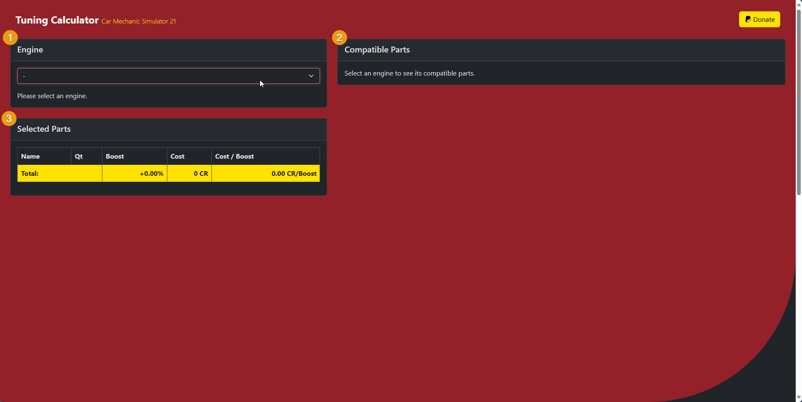
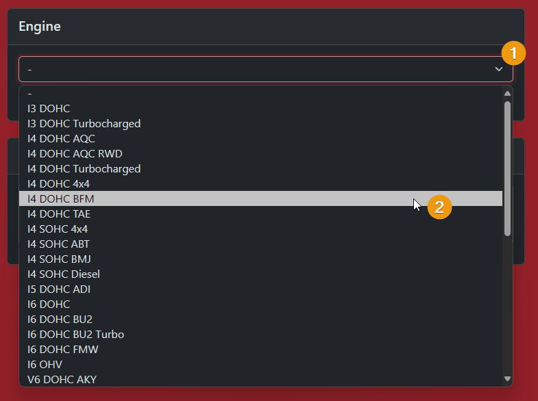
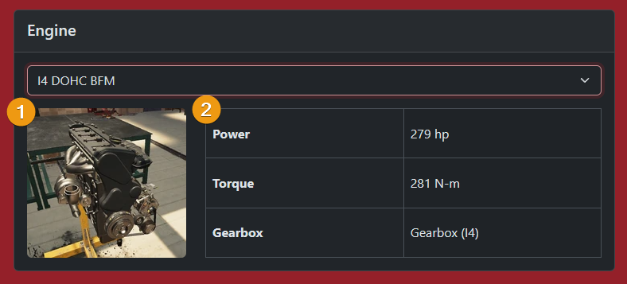
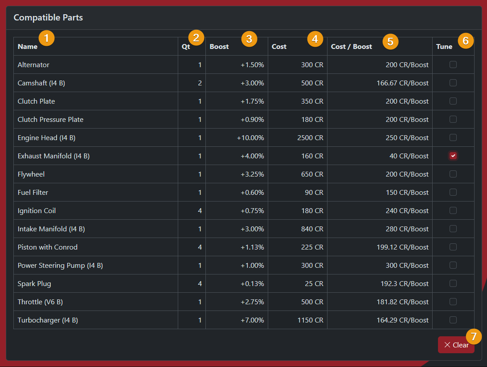
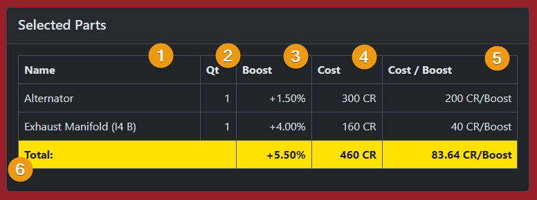

<!-- Improved compatibility of back to top link: See: https://github.com/othneildrew/Best-README-Template/pull/73 -->
<a name="readme-top"></a>

<!-- PROJECT SHIELDS -->
<!--
*** I'm using markdown "reference style" links for readability.
*** Reference links are enclosed in brackets [ ] instead of parentheses ( ).
*** See the bottom of this document for the declaration of the reference variables
*** for contributors-url, forks-url, etc. This is an optional, concise syntax you may use.
*** https://www.markdownguide.org/basic-syntax/#reference-style-links
-->
[![Contributors][contributors-shield]][contributors-url]
[![Forks][forks-shield]][forks-url]
[![Stargazers][stars-shield]][stars-url]
[![Issues][issues-shield]][issues-url]
[![GNU GPL v3 License][license-shield]][license-url]


<!-- PROJECT LOGO -->
<br />
<div align="center">
  <a href="https://github.com/TryphonX/CMS-Tuning-Calculator">
    
  </a>

<h3 align="center">CMS Tuning Calculator</h3>

  <p align="center">
    This web app tool is useful for tuning cars in the game (Car Mechanic Simulator 21). Provides a lot of functionalities that make tuning considerably easier as well as allowing you to explore the most efficient way of tuning the car to the desired boost percentage. All tuning combinations by this tool will always be "symmetrical" - it will not allow you to switch some of the same part with tuned parts, it's either all or nothing. This tool is <b><i>just a calculator</i></b> (at least for now), it will not recommend tuning setups on its own, it will just provide you with all the information you need to make your decision.
    <br />
    <a href="https://github.com/TryphonX/CMS-Tuning-Calculator/docs/"><strong>Explore the docs »</strong></a>
    <br />
    <br />
    <a href="https://tryphonx.github.io/CMS-Tuning-Calculator/">Visit App</a>
    ·
    <a href="https://github.com/TryphonX/CMS-Tuning-Calculator/issues">Report Bug</a>
    ·
    <a href="https://github.com/TryphonX/CMS-Tuning-Calculator/issues">Request Feature</a>
  </p>
</div>


<!-- TABLE OF CONTENTS -->
<details>
  <summary>Table of Contents</summary>
  <ol>
    <li>
      <a href="#about-the-project">About The Project</a>
      <ul>
        <li><a href="#built-with">Built With</a></li>
      </ul>
    </li>
    <li>
      <a href="#usage">Usage</a>
      <ul>
        <li><a href="#first-step">First Step</a></li>
        <li><a href="#second-step">Second Step</a></li>
        <li><a href="#third-step">Third Step</a></li>
      </ul>
    </li>
    <li><a href="#roadmap">Roadmap</a></li>
    <li><a href="#contributing">Contributing</a></li>
    <li><a href="#license">License</a></li>
    <li><a href="#acknowledgments">Acknowledgments</a></li>
  </ol>
</details>


<!-- ABOUT THE PROJECT -->
## About The Project

[![Product Name Screen Shot][product-screenshot]](https://tryphonx.github.io/CMS-Tuning-Calculator/)

This web app tool is useful for tuning cars in the game (Car Mechanic Simulator 21). Provides a lot of functionalities that make tuning considerably easier as well as allowing you to explore the most efficient way of tuning the car to the desired boost percentage. All tuning combinations by this tool will always be "symmetrical" - it will not allow you to switch some of the same part with tuned parts, it's either all or nothing. This tool is _**just a calculator**_ (at least for now), it will not recommend tuning setups on its own, it will just provide you with all the information you need to make your decision.

<p align="right">(<a href="#readme-top">back to top</a>)</p>


### Built With

[![React][React.js]][React-url]  
[![Bootstrap][Bootstrap.com]][Bootstrap-url]  
[![Sass][Sass]][Sass-url]  
[![ESLint][ESLint]][ESLint-url]  

<p align="right">(<a href="#readme-top">back to top</a>)</p>


<!-- GETTING STARTED -->
<!--
## Getting Started

This is an example of how you may give instructions on setting up your project locally.
To get a local copy up and running follow these simple example steps.

### Prerequisites

This is an example of how to list things you need to use the software and how to install them.
* npm
  ```sh
  npm install npm@latest -g
  ```

### Installation

1. Get a free API Key at [https://example.com](https://example.com)
2. Clone the repo
   ```sh
   git clone https://github.com/TryphonX/CMS-Tuning-Calculator.git
   ```
3. Install NPM packages
   ```sh
   npm install
   ```
4. Enter your API in `config.js`
   ```js
   const API_KEY = 'ENTER YOUR API';
   ```

<p align="right">(<a href="#readme-top">back to top</a>)</p>
-->

<!-- USAGE INSTRUCTIONS -->
## Usage

The use of this app is relatively easy. The calculator app is broken down into three basic components.

1. Engine Card
2. Compatible Parts Card
3. Selected Parts Card



### First step

First step is to pick an engine from the dropdown menu in the **_Engine Card_**.

When you pick an engine, the Engine Card is immediately updated to reflect your choice and the rest of the functionality of the app is unlocked on the rest of the components.



> **⚠️ Note:** When you pick a new engine, all the choices you make in the other components will be cleared.

After making your choice, an **image of the engine** (1) is shown along with its **specifications** (2). Engine specifications include _power_, _torque_ and _gearbox_.



### Second Step

Second step is to check the _**Compatible Parts Card**_ and choose which parts to tune.

This card will be now displaying a table with all (known) compatible parts for that engine. For each part, important info will be displayed in order to make the best decision about which parts to tune or not.

Specifically for each part you receive this information:

| Information      | Description                                               |
| ---------------- | --------------------------------------------------------- |
| Name (1)         | The part's name                                           |
| Quantity (2)     | How many are fitted on this engine                        |
| Boost (3)        | How much boost the tuned version of the part will produce |
| Cost (4)         | How much the part costs (price is for single part)        |
| Cost / Boost (5) | How many CR it takes to produce +1% of boost              |

The **Tune** (6) column is where you can choose the parts you want to tune. Simply click the checkbox of the part you want to tune and the part will be used in the calculation.

The **Clear** (7) button at the bottom right corner of the card will empty your list of selected parts so you can start your list from scratch.



> **⚠️  Note:** When choosing a part with a quantity value greater than 1 keep in mind all of them will be added as selected parts. You can not add 1 of a part that has 2 on an engine.

### Third Step

Third step is to check the _**Selected Parts Card**_.

This is kind of your "shopping cart" in a way. It includes a list of all the parts you've selected along with its info (same as in compatible parts) and their total values.



> **⚠️ Note:** Parts with a quantity value great than 1 will multiply their cost and boost by their quantity value.

_[Visit the app now to try it »](https://tryphonx.github.io/CMS-Tuning-Calculator/)_

<p align="right">(<a href="#readme-top">back to top</a>)</p>

<!-- ROADMAP -->
## Roadmap

- [ ] Add suggested setups based on required boost
- [ ] Add sorting functionality to the tables

See the [open issues](https://github.com/TryphonX/CMS-Tuning-Calculator/issues) for a full list of proposed features (and known issues).

<p align="right">(<a href="#readme-top">back to top</a>)</p>

<!-- CONTRIBUTING -->
## Contributing

Contributions are what make the open source community such an amazing place to learn, inspire, and create. Any contributions you make are **greatly appreciated**.

If you have a suggestion that would make this better, please fork the repo and create a pull request. You can also simply open an issue with the tag "enhancement".
Don't forget to give the project a star! Thanks again!

1. Fork the Project
2. Create your Feature Branch (`git checkout -b feat/amazingFeature`)
3. Commit your Changes (`git commit -m 'feat: add some amazingFeature'`)
4. Push to the Branch (`git push origin feat/amazingFeature`)
5. Open a Pull Request

<p align="right">(<a href="#readme-top">back to top</a>)</p>

<!-- LICENSE -->
## License

Distributed under the GNU GPL v3 License. See `COPYING.txt` for more information.

<p align="right">(<a href="#readme-top">back to top</a>)</p>

<!-- ACKNOWLEDGMENTS -->
## Acknowledgments

* [Choose an Open Source License](https://choosealicense.com)
* [Img Shields](https://shields.io)
* [GitHub Pages](https://pages.github.com)
* [Auto-Changelog](https://github.com/CookPete/auto-changelog)
* [React Bootstrap](https://react-bootstrap.netlify.app/)
* [React Icons](https://react-icons.github.io/react-icons)
* [Best README Template](https://github.com/othneildrew/Best-README-Template)
* [Digian (CSS Template)](https://www.free-css.com/free-css-templates/page294/digian)
* [Favicon Generator](https://favicon.io/favicon-generator/)
* [JsDoc to Markdown](https://www.npmjs.com/package/jsdoc-to-markdown)
* [React DocGen](https://www.npmjs.com/package/react-docgen)

<p align="right">(<a href="#readme-top">back to top</a>)</p>

<!-- MARKDOWN LINKS & IMAGES -->
<!-- https://www.markdownguide.org/basic-syntax/#reference-style-links -->
[contributors-shield]: https://img.shields.io/github/contributors/TryphonX/CMS-Tuning-Calculator?style=for-the-badge
[contributors-url]: https://github.com/TryphonX/CMS-Tuning-Calculator/graphs/contributors
[forks-shield]: https://img.shields.io/github/forks/TryphonX/CMS-Tuning-Calculator.svg?style=for-the-badge
[forks-url]: https://github.com/TryphonX/CMS-Tuning-Calculator/network/members
[stars-shield]: https://img.shields.io/github/stars/TryphonX/CMS-Tuning-Calculator.svg?style=for-the-badge
[stars-url]: https://github.com/TryphonX/CMS-Tuning-Calculator/stargazers
[issues-shield]: https://img.shields.io/github/issues/TryphonX/CMS-Tuning-Calculator?style=for-the-badge
[issues-url]: https://github.com/TryphonX/CMS-Tuning-Calculator/issues
[license-shield]: https://img.shields.io/github/license/TryphonX/CMS-Tuning-Calculator?style=for-the-badge
[license-url]: https://github.com/TryphonX/CMS-Tuning-Calculator/blob/main/COPYING.txt
[product-screenshot]: images/main-app-screenshot.png
[React.js]: https://img.shields.io/badge/React-20232A?style=for-the-badge&logo=react&logoColor=61DAFB
[React-url]: https://reactjs.org/
[Bootstrap.com]: https://img.shields.io/badge/Bootstrap-563D7C?style=for-the-badge&logo=bootstrap&logoColor=white
[Bootstrap-url]: https://getbootstrap.com
[Sass]: https://img.shields.io/badge/Sass-CC6699?style=for-the-badge&logo=sass&logoColor=white
[Sass-url]: https://sass-lang.com/
[ESLint]: https://img.shields.io/badge/ESLint-18191a?style=for-the-badge&logo=eslint&logoColor=%234B32C3
[ESLint-url]: https://eslint.org/
[CreateReactApp]: https://img.shields.io/badge/Create%20React%20App-303846?style=for-the-badge&logo=createreactapp&logoColor=%2309D3AC
[CreateReactApp-url]: https://create-react-app.dev/