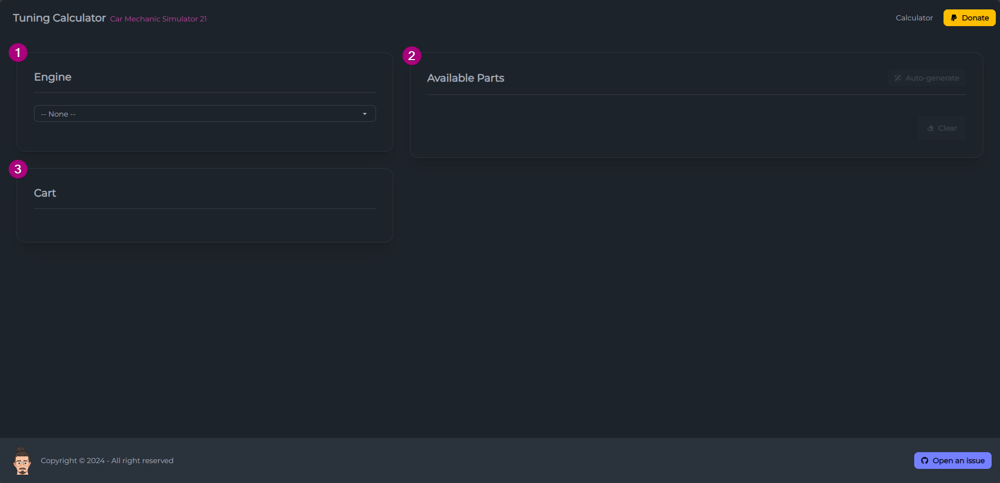
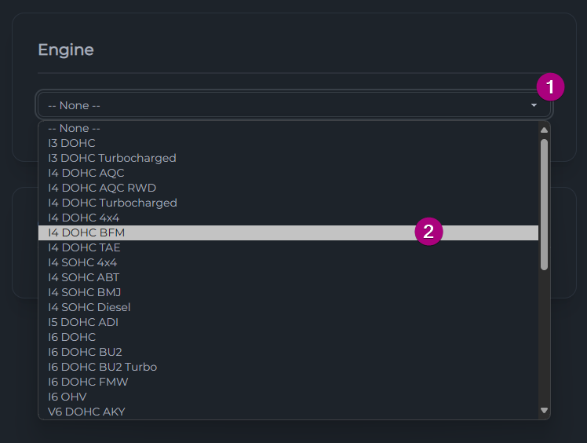
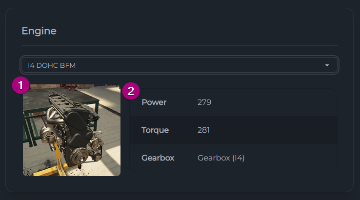
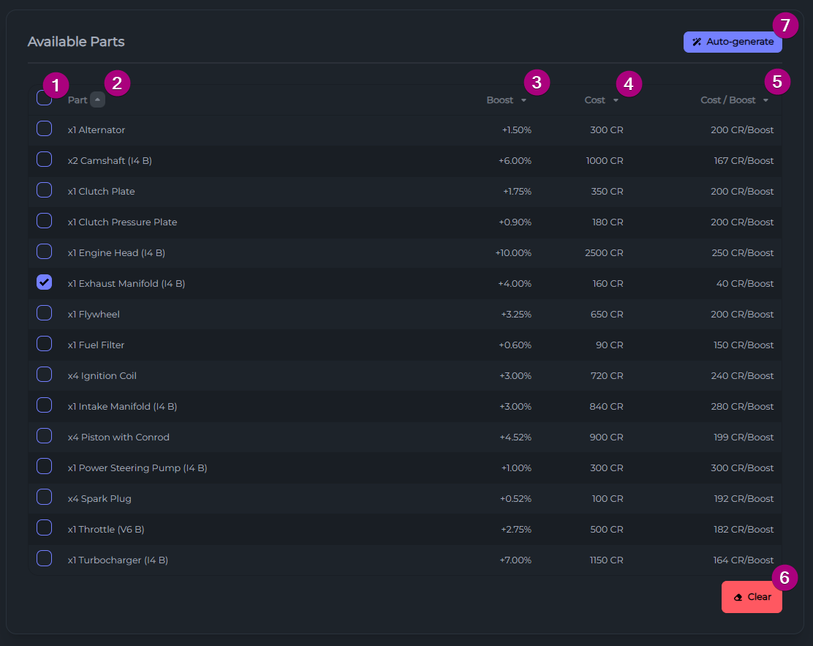
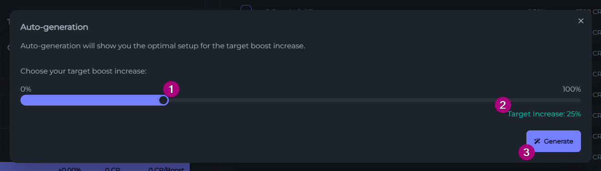
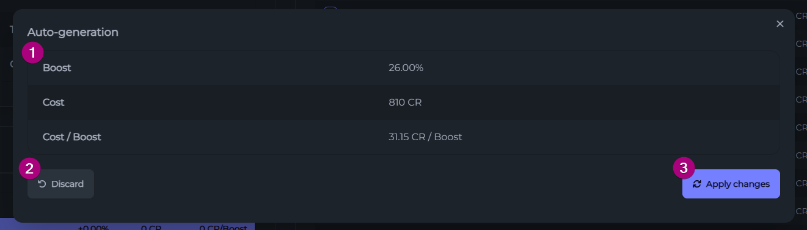
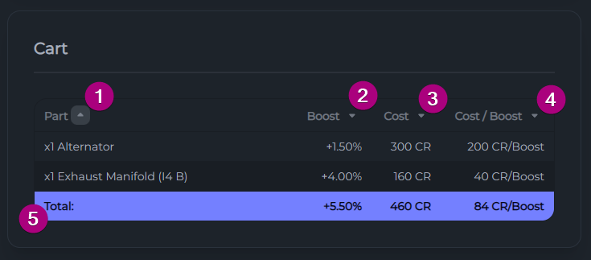

<!-- Improved compatibility of back to top link: See: https://github.com/othneildrew/Best-README-Template/pull/73 -->
<h1></h1>

<!-- PROJECT SHIELDS -->
<!--
*** I'm using markdown "reference style" links for readability.
*** Reference links are enclosed in brackets [ ] instead of parentheses ( ).
*** See the bottom of this document for the declaration of the reference variables
*** for contributors-url, forks-url, etc. This is an optional, concise syntax you may use.
*** https://www.markdownguide.org/basic-syntax/#reference-style-links
-->
[][semantic-release-url]

<!-- PROJECT LOGO -->
 

  

<h3 align="center">CMS Tuning Calculator</h3>

  

    This web app tool is useful for tuning cars in the game (Car Mechanic Simulator 21). Provides a lot of functionalities that make tuning considerably easier as well as allowing you to explore the most efficient way of tuning the car to the desired boost percentage. All tuning combinations by this tool will always be "symmetrical" - it will not allow you to switch some of the same part with tuned parts, it's either all or nothing. This tool can also suggest the optimal setup if you want, or you can make your own informed decision.
     
    <!--
		<a href="https://github.com/Tryphonx/cms-Tuning-Calculator/docs/"><strong>Explore the docs »</strong></a>
		-->
     
     
    <a href="https://tryphonx.github.io/CMS-Tuning-Calculator/">Visit App</a>
    ·
    <a href="https://github.com/Tryphonx/cms-Tuning-Calculator/issues">Report Bug</a>
    ·
    <a href="https://github.com/Tryphonx/cms-Tuning-Calculator/issues">Request Feature</a>
  

<!-- TABLE OF CONTENTS -->

  
Table of Contents

  <ol>
    <li>
      <a href="#about-the-project">About The Project</a>
      <ul>
        <li><a href="#built-with">Built With</a></li>
      </ul>
    </li>
    <li>
      <a href="#usage">Usage</a>
      <ul>
        <li><a href="#first-step">First Step</a></li>
        <li><a href="#second-step">Second Step</a></li>
        <li><a href="#third-step">Third Step</a></li>
      </ul>
    </li>
    <li><a href="#roadmap">Roadmap</a></li>
    <li><a href="#contributing">Contributing</a></li>
    <li><a href="#license">License</a></li>
    <li><a href="#acknowledgments">Acknowledgments</a></li>
  </ol>

<!-- ABOUT THE PROJECT -->
## About The Project

[![App preview][app-url]](https://tryphonx.github.io/CMS-Tuning-Calculator/)

This web app tool is useful for tuning cars in the game (Car Mechanic Simulator 21). Provides a lot of functionalities that make tuning considerably easier as well as allowing you to explore the most efficient way of tuning the car to the desired boost percentage. All tuning combinations by this tool will always be "symmetrical" - it will not allow you to switch some of the same part with tuned parts, it's either all or nothing. This tool can also suggest the optimal setup if you want, or you can make your own informed decision.

(<a href="#readme-top">back to top</a>)

### Built With

[![React][React.js]][React-url]  
[![NextJS][Next-icon]][Next-url]  
[![TailwindCSS][Tailwind-icon]][Tailwind-url]  
[![daisyUI][daisyUI-icon]][daisyUI-url]  
[![ESLint][ESLint]][ESLint-url]  

(<a href="#readme-top">back to top</a>)

<!-- USAGE INSTRUCTIONS -->
## Usage

The use of this app is relatively easy. The calculator app is broken down into three basic components.

1. Engine Card
2. Available Parts Card
3. Cart Card
4. Auto-generation (not shown on the screenshot)

### First step

First step is to pick an engine from the dropdown menu in the **_Engine Card_**.

When you pick an engine, the Engine Card is immediately updated to reflect your choice and the rest of the functionality of the app is unlocked on the rest of the components.

> `NEW!` You can now also filter by engine configuration if you wish to!

> **⚠️ Note:** When you pick a new engine, all the choices you make in the other components will be cleared.

After making your choice, an **image of the engine** (1) is shown along with its **specifications** (2). Engine specifications include _power_, _torque_ and _gearbox_.

### Second Step

Second step is to check the _**Available Parts Card**_ and choose which parts to tune or use the _**Auto-generate**_ button.

#### Available Parts Card

This card will be now displaying a table with all (known) available parts for that engine. For each part, important info will be displayed in order to make the best decision about which parts to tune or not.

Specifically, for each part you receive this information:

The first column (1) is where you can choose the parts you want to tune. Simply click the checkbox of the part you want to tune and the part will be used in the calculation. Clicking the first checkbox will select (or deselect) all parts.

| Information          | Description                                                  |
| -------------------- | ------------------------------------------------------------ |
| Part (2)             | The part's name and how many times it appears on that engine |
| Boost\* (3)          | How much boost the tuned version of the part will produce    |
| Cost\* (4)           | How much it costs to tune                                    |
| Cost / Boost\*\* (5) | How many CR it takes to produce +1% of boost                 |

> \* total, if the part appears multiple times in the engine  
> \*\* not visible on small screens

The **Clear** (6) button at the bottom right corner of the card will empty your list of selected parts so you can start your list from scratch.

The **Auto-generate** (7) button at the top right corner of the card will open the auto-generation window. Shown later.

> **⚠️  Note:** When choosing a part that appears multiple times in an engine, keep in mind all of them will be added as selected parts. You can not add 1 of a part that has 2 on an engine.

#### Auto-generate ✨

The Auto-generate button leads you to a different process, where you enter the desired outcome and you get the optimal setup.

Specifically, you are greeted with a popup requesting you input the target boost increase (1). You can see the currently selected value below the slider (2). When ready, click the **🪄 Generate** button.

By clicking the **🪄 Generate** button, you will get the optimal setup, if there is one that fulfills the requirements. You will be given the stats of the proposed setup (1) as well as the options to discard (2) -and go to the previous page- and apply changes (3). Pressing apply changes will replace any prior selection of parts you had with the ones that the optimal setup consists of. The popup will close and you will be able to see the results in the next step.

### Third Step

Third step is to check the _**Cart Card**_.

This is kind of your "shopping cart" in a way. It includes a list of all the parts you've selected along with its info (same as in compatible parts) and their total values.

_[Visit the app now to try it »](https://tryphonx.github.io/CMS-Tuning-Calculator/)_

(<a href="#readme-top">back to top</a>)

<!-- ROADMAP -->
<!-- ## Roadmap

- [x] Add suggested setups based on required boost
- [x] Add sorting functionality to the tables

See the [open issues](https://github.com/Tryphonx/cms-Tuning-Calculator/issues) for a full list of proposed features (and known issues).

(<a href="#readme-top">back to top</a>)
 -->

<!-- CONTRIBUTING -->
## Contributing

Contributions are what make the open source community such an amazing place to learn, inspire, and create. Any contributions you make are **greatly appreciated**.

If you have a suggestion that would make this better, please fork the repo and create a pull request. You can also simply open an issue with the tag "enhancement".
Don't forget to give the project a star! Thanks again!

1. Fork the Project
2. Create your Feature Branch from `dev` branch (`git checkout -b feat/amazingFeature`)
3. Commit your Changes
4. Push to the Branch (`git push origin feat/amazingFeature`)
5. Open a Pull Request to `dev`

> `New!` Commit messages no longer go through linting. Feel free to use any format you like. Pull requests are squashed instead.

(<a href="#readme-top">back to top</a>)

<!-- LICENSE -->
## License

Distributed under the GNU GPL v3 License. See `COPYING.txt` for more information.

(<a href="#readme-top">back to top</a>)

<!-- ACKNOWLEDGMENTS -->
## Acknowledgments

- [Img Shields](https://shields.io)
- [React Icons](https://react-icons.github.io/react-icons)
- [Best README Template](https://github.com/othneildrew/Best-README-Template)
- [Favicon Generator](https://favicon.io/favicon-generator/)
- [semantic-release][semantic-release-url]

(<a href="#readme-top">back to top</a>)

<!-- MARKDOWN LINKS & IMAGES -->
<!-- https://www.markdownguide.org/basic-syntax/#reference-style-links -->
[semantic-release-url]: https://github.com/semantic-release/semantic-release
[app-url]: images/v2/main-app-screenshot.png
[React.js]: https://img.shields.io/badge/React-20232A?style=for-the-badge&logo=react&logoColor=61DAFB
[React-url]: https://reactjs.org/
[Next-icon]: https://img.shields.io/badge/Next.js-000000?style=for-the-badge&logo=nextdotjs&logoColor=white
[Next-url]: https://nextjs.org/
[Tailwind-icon]: https://img.shields.io/badge/TailwindCSS-06B6D4?style=for-the-badge&logo=tailwindcss&logoColor=white
[Tailwind-url]: https://tailwindcss.com/
[daisyUi-icon]: https://img.shields.io/badge/daisyUI-5A0EF8?style=for-the-badge&logo=daisyui&logoColor=white
[daisyUi-url]: https://daisyui.com/
[ESLint]: https://img.shields.io/badge/ESLint-18191a?style=for-the-badge&logo=eslint&logoColor=%234B32C3
[ESLint-url]: https://eslint.org/
